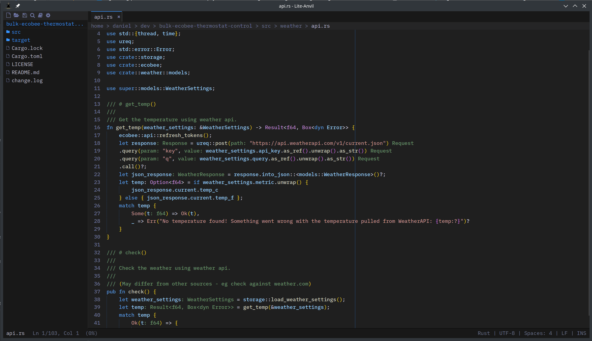

# Lite Anvil

A fast code editor built in Rust with SDL3.

  <a href="installation/" class="primary">Get Started</a>
  <a href="https://github.com/danpozmanter/lite-anvil" class="secondary">View on GitHub</a>

## Key Features

### Built-in LSP

Diagnostics, completion, hover, go-to-definition, references, inlay hints, and more for Rust, Python, TypeScript, Go, C/C++, and other languages.

### Embedded Terminal

Full PTY terminal with ANSI/VT100 colors, scrollback, and multi-terminal support.

### Git Integration

Git status view, gutter markers, per-line blame annotations, file commit log, push, pull, commit, stash from the command palette.

### 50+ Syntax Grammars

Rust, Go, Python, TypeScript, C/C++, Java, Kotlin, Scala, F#, C#, Haskell, Zig, Elixir, Erlang, OCaml, Gleam, and many more.

### Fast

Pure Rust. Sub-second startup. Low memory footprint. Ring-buffer terminal scrollback, glyph cache with ASCII pre-warming, merged undo entries.

### Multi-Cursor Editing

Ctrl+Shift+Up/Down to add cursors. Typing, deletion, and movement apply to all cursors simultaneously.

### Code Folding & Minimap

Fold code blocks with Ctrl+Shift+[. Syntax-colored minimap with click-to-scroll.

### Session Restore

Open files, active tab, font scale, and project root persist across restarts. Recent projects list for quick switching.

### Bookmarks & Find-in-Selection

Ctrl+F4 to bookmark lines, F4/Shift+F4 to navigate. Find scopes to the selection when a multi-line region is active.

### Bracket Pair Colorization

Matching brackets colored by nesting depth (gold, pink, blue) like VS Code.

### Find & Replace in Files

Find and Replace across files in a project folder.

### Markdown Preview

Side-by-side rendered preview with task-list checkboxes (struck through when checked), code blocks, and the rest of CommonMark.

### Auto-Reload on Disk Changes

External edits are picked up automatically, even across atomic save-by-rename patterns. If the buffer is dirty, a modal Reload-from-disk prompt asks before overwriting your changes.

### Nano Anvil

A minimal single-file editor with software rendering. No GPU driver overhead -- ~28MB RAM on Linux. No sidebar, terminal, LSP, git, or tabs.

### Note Anvil

A markdown note-taking app with a side-by-side preview. Same software-rendering footprint as Nano Anvil, tuned for quick capture and Zettelkasten-style notes.

## Overview

Lite Anvil is a fork of [Lite XL](https://github.com/lite-xl/lite-xl), rewritten from the ground up in Rust.

Lite Anvil also ships **Nano Anvil**, a minimal single-file editor that uses software rendering (no GPU drivers), and **Note Anvil**, a markdown note-taking app with live preview. See the [Installation](installation.md) page for details on all three binaries.

| | |
|---|---|
| **Languages** | 50+ syntax grammars, built-in LSP configurations |
| **Platform** | Linux, macOS, Windows |
| **License** | MIT |
| **Rust version** | 1.85+ |
