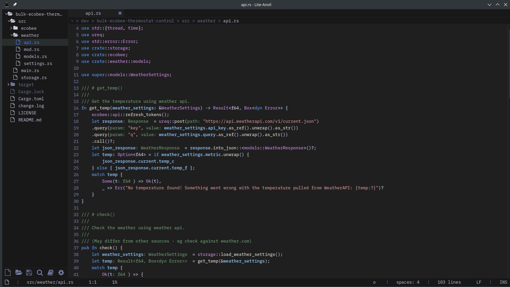

# Lite-Anvil

A lightweight, lightning fast, and powerful code editor built in Rust, with Lua for user plugins.

  <a href="installation/" class="primary">Get Started</a>
  <a href="https://github.com/danpozmanter/lite-anvil" class="secondary">View on GitHub</a>

## Key Features

### Built-in LSP

25+ languages with diagnostics, completion, hover, go-to-definition, references, rename, code actions, formatting, inlay hints, semantic highlighting, and call/type hierarchy.

### Embedded Terminal

Full PTY terminal with ANSI colors, scrollback, color schemes. Open bottom, left, right, or as a tab.

### Integrated Test Runner

Auto-detects Cargo, npm/vitest/jest, pytest, Go, dotnet, Gradle, Maven, sbt, PHPUnit, Make. Run all tests or the current file.

### Git Integration

Branch/status in status bar, tree highlighting, diff views, stage/unstage, commit, push, pull, stash.

### 50+ Syntax Grammars

Rust, Go, Python, TypeScript, C/C++, Java, Kotlin, Scala, F#, C#, Haskell, Zig, Elixir, Erlang, OCaml, Gleam, Dart, Swift, Ruby, and many more.

### Fast & Lightweight

Native Rust core. Sub-second startup. Low memory footprint. All core modules, views, commands, and bundled plugins are pure Rust via mlua.

### Multi-Cursor Editing

Ctrl+D to add next occurrence, Ctrl+Shift+L for all occurrences, Ctrl+Alt+L to turn find matches into cursors.

### Project Workspace Memory

Open files, tabs, splits, and scroll positions restore when switching between projects.

### Bookmarks & Indent Guides

Toggle line bookmarks (Ctrl+F2), navigate with F2. Vertical indent guides at each level. Line sorting, unique, reverse.

## Overview

Lite-Anvil is a fork of [Lite XL](https://github.com/lite-xl/lite-xl), rewritten from the ground up in Rust. The core, all views, commands, and bundled plugins are native Rust. User plugins and configuration remain Lua for easy extensibility.

| | |
|---|---|
| **Languages** | 50+ syntax grammars, 25+ built-in LSP configurations |
| **Platform** | Linux, macOS, Windows |
| **License** | MIT |
| **Rust version** | 1.85+ |
